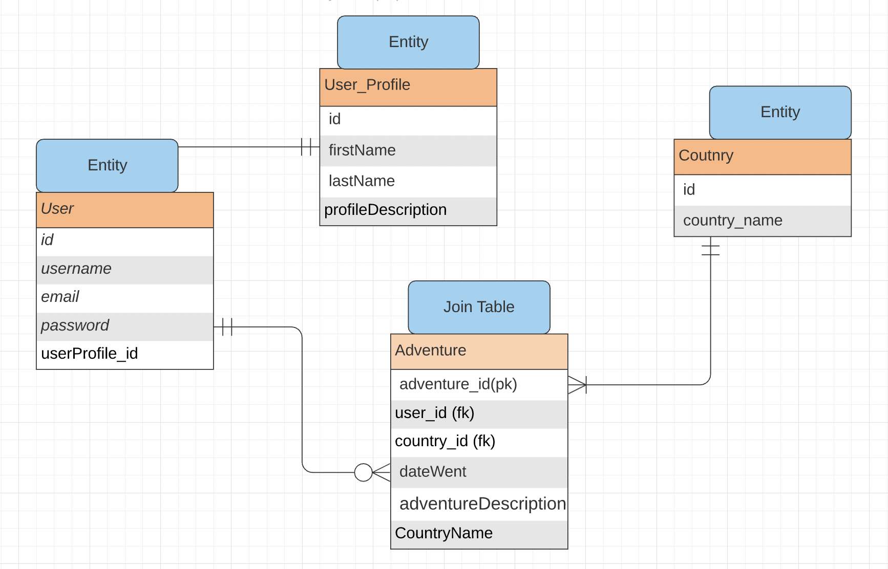

# A World Well Traveled

This is the backend for a World Traveled tracking application. It allows users to create a new custom adventure as well as see past travels. We've created various endpoints that will allow users to view and manipulate the data stored in the database at their leisure. We use authentication to ensure that all adventures are only visible to each individual user once they are logged in. 

### User Stories
- A user should be able to create a new User account.
- A user should be able to log in using the credentials they entered when they created their account.
- A user should be able to create a new Adventure.
- A user should be able to see which distinct countries they've visited.
- A user should be able to update an Adventure.
- A user should be able to delete an Adventure.
- A user should be able to create a UserProfile.
- A user shoul dbe able to see a list of all of their adventures, regardless of country.
- A user should be able to update their UserProfile.
- A user should be able to retrieve a single Adventure.
- A user should be able to retrieve a single Country.
- A user should be able to update the email address on file.
- A user should be able to change their password.

### Technologies Used
- Java
- Spring Boot
- Postgres
- Postman (for testing endpoints)

### Domain Models & ERD

**User**
- **PK** Long id
- **FK** Long userProfileId
- String userName
- String email
- String password *(encoded)*

**Adventure**
- **PK** Long id
- **FK** Long userId
- **FK** Long countryId
- String dateWent
- String adventureDescription
- String countryName

**Country**
- **PK** Long id
- String countryName

**UserProfile**
- **PK** Long id
- String firstName
- String lastName
- String profileDescription

